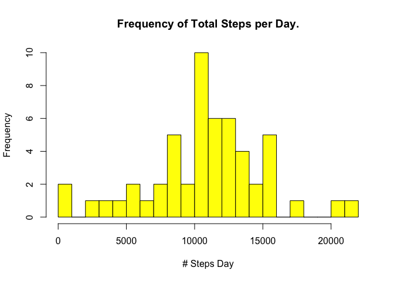
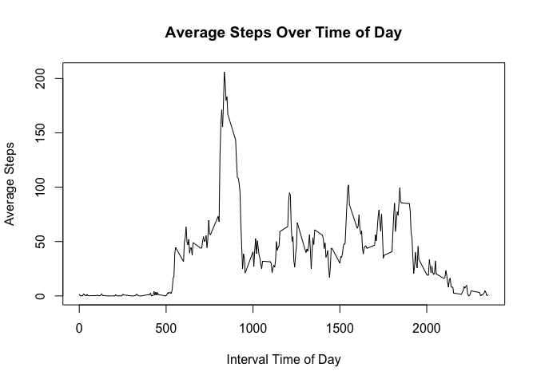
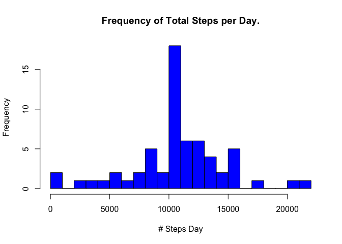
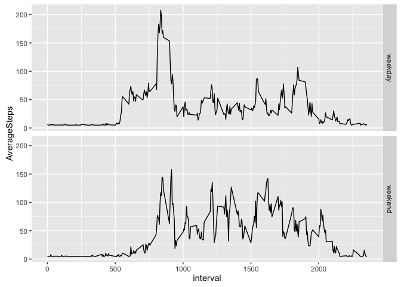

# Peer Graded Assignment: Course Project 1
Douglas Weatherhead  
September 13, 2016  


## Loading and preprocessing the data

Here we will load the raw data and ensure the formats are correct, Dates are Dates and numbers are numbers.


```r
### Read activity data into a dataframe
data_raw <- read.csv("activity.csv")

# Convert to Date format
data_raw$date <- as.Date(data_raw$date)
# Convert Steps to numeric format
data_raw$steps <- as.numeric(data_raw$steps)
```

## What is mean total number of steps taken per day?

Lets take a look at how many steps are taken on average!

1. Make a histogram of the total number of steps taken each day

2. Calculate and report the mean and median total number of steps taken per day


```r
## We'll first need to load a package to help wrangle the data.
library("dplyr", warn.conflicts = FALSE)
```

```
## Warning: package 'dplyr' was built under R version 3.2.5
```

```r
# Remove NAs from dataset to determine steps taken each day!
data <- na.omit(data_raw)

## Data Wrangle Processed Data Set
stepsperday <- data %>% 
    group_by(date) %>% 
    summarize(TotalSteps=sum(steps))

## Plot Histogram of total steps per day
hist(stepsperday$TotalSteps, 
     breaks = 20,
     xlab = "# Steps Day", 
     main = "Frequency of Total Steps per Day.",
     col = 7)
```

<!-- -->

```r
## Find AVERAGE Steps Per Date
mean_steps <- mean(stepsperday$TotalSteps)

## Find MEDIAN Steps Per Date
median_steps <- median(stepsperday$TotalSteps)
```
The **_average_** steps per a day is: 10766.19 ... 
and the **_median_** steps per a day is 10765.


## What is the average daily activity pattern?

1. Make a time series plot (i.e. type = "l") of the 5-minute interval (x-axis) and the average number of steps taken, averaged across all days (y-axis)

2. Which 5-minute interval, on average across all the days in the dataset, contains the maximum number of steps?


```r
# Group data by 5 minute interval and summarize the average
# number of steps in that interval
interval_average <- data %>%
    group_by(interval) %>%
    summarize(AverageSteps=mean(steps))

plot( x = interval_average$interval, y = interval_average$AverageSteps,
      type = "l",
      xlab = "Interval Time of Day",
      ylab = "Average Steps",
      main = "Average Steps Over Time of Day")
```

<!-- -->

```r
## Find the Peak Steps interval time
peak_interval <- interval_average$interval[which.max(interval_average$AverageSteps)]
```
The 5-minute interval with the most average steps is 835


#Imputing missing values

Lets find out how many missing values are in the steps column of the data_raw DF


```r
### How many missing values are in the steps column of the data_raw DF
num_NA <- sum(is.na(data_raw$steps))
```
2304  records are missing values and are labelled "NA"".


We can now impute values into the missing values, for this example we will use the average steps for all intervals


```r
###Impute NA Values as the average steps for all intervals
### First find the average steps per interval
average_interval_steps <- mean(interval_average$AverageSteps)

## Now impute this average into the missing NA's
data_raw$steps[is.na(data_raw$steps)] <- average_interval_steps

### Check to see if the NA's have been imputed
### Find how many missing values are in the steps column of the data_raw DF
num_NA <- sum(is.na(data_raw$steps))
```
Now 0  records are missing values and are "NA".


Lets plot the new imputed dataset and see the differences compared to the raw data set.

```r
## Data Wrangle imputed Data Set
stepsperday <- data_raw %>% 
    group_by(date) %>% 
    summarize(TotalSteps=sum(steps))

## Plot Histogram of total steps per day with the imputed data
hist(stepsperday$TotalSteps, 
     breaks = 20,
     xlab = "# Steps Day", 
     main = "Frequency of Total Steps per Day.",
     col = 4)
```

<!-- -->

```r
## Find AVERAGE Steps Per Date of imputed dataset
mean_steps_impute <- mean(stepsperday$TotalSteps)

## Find MEDIAN Steps Per Date of imputed dataset
median_steps_impute <- median(stepsperday$TotalSteps)
```
#### Differences Between Raw Data and Imputed Data
The **_average_** steps per a day with imputed data is: 10766.19 ... 
and the **_median_** steps per a day with imputed data is 10766.19.

The **Difference** in **_average_** steps between the two datasets (imputed and removed 'NA' Values) is 0

The **Difference** in **_median_** steps between the two datasets (imputed and removed 'NA' Values) is 1.1886792

_From a mean and median perspective little absolute differences are realized by imputing the values._

# Are there differences in activity patterns between weekdays and weekends?

Lets consider differences between weekdays and weekends. First we'll need to define a new feature variable and then plot the results.


```r
## Make a feature variable with each date's corresponding Day
data_raw$day <- weekdays(data_raw$date)

## Make all day's weekday and then change Sat / Sun to Weekend
data_raw$weekend <- "weekday"
data_raw$weekend[data_raw$day %in% c("Saturday", "Sunday")] <- "weekend"

## Subset and group data by weekend/weekday and interval time finding the average steps for this group segmentation.
weekend_average <- data_raw %>%
    group_by(weekend, interval) %>%
    summarize(AverageSteps=mean(steps))

## Create Multi Panel Plot
## Load ggplot2 
library(ggplot2)
```

```
## Warning: package 'ggplot2' was built under R version 3.2.4
```

```r
## Plot the average steps vs interval , one panel Weekday - another Weekend.
qplot(x =  interval, 
      y = AverageSteps,
      data = weekend_average,
      geom = "line", 
      facets = weekend ~ .) 
```

<!-- -->

####As we could hypothesis, there are differences in step activity between weekdays and weekends!


